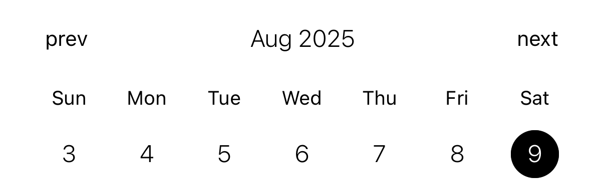

# react-native-simple-weekly-calendar

A React Native component specialized for weekly calendars. The user interface is inspired by [react-native-calendars](https://github.com/wix/react-native-calendars).


## Installation

```sh
npm install react-native-simple-weekly-calendar
```

## Usage

```jsx
import { WeeklyCalendar } from 'react-native-simple-weekly-calendar';
```

```jsx
<WeeklyCalendar
// props
/>
```

## Examples

Code examples can be found [here](example/src/use-cases/).

### Basic calendar



### Calendar with marked dates


### Themed calendar


### Calendar with custom components


## Props

### `dayComponent`

Redefine the date element.

- Type: `(props: DayComponentProps) => ReactNode`

### `dayHeaderComponent`

Redefine the day of the week element.

- Type: `(props: DayHeaderComponentProps) => ReactNode`

### `initialDate`

The week containing this date is determined as the initial week of the calendar. Uses `YYYY-MM-DD` format.

- Type: `string`

### `markedDays`

You can add a mark to a specific date.

- Type: `MarkedDayProps[]`

### `monthComponent`

Redefine the month element.

- Type: `(props: MonthComponentProps) => ReactNode`

### `nextComponent`

Redefine the element that moves to the future week.

- Type: `(props: NextComponentProps) => ReactNode`

### `onDayPress`

A function called when a date is selected.

- Type: `(date: string) => void`

### `prevComponent`

Redefine the element that moves to the past week.

- Type: `(props: PrevComponentProps) => ReactNode`

### `selectedDate`

The selected date. Uses `YYYY-MM-DD` format.

- Type: `string`

### `theme`

Defines the colors of the elements that make up the calendar.

- Type: `WeeklyCalendarTheme`

## Contributing

See the [contributing guide](CONTRIBUTING.md) to learn how to contribute to the repository and the development workflow.

## License

MIT

---

Made with [create-react-native-library](https://github.com/callstack/react-native-builder-bob)
